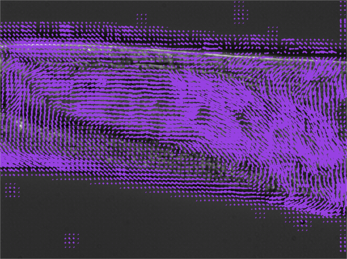
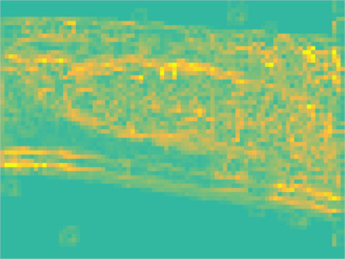

### DICCOR ###

A full set of MATLAB routines for generating displacement vector fields from time series of moving textures. The algorithm uses a spatial Fourier transform to efficiently compute the cross-correlation function for two images, as well as a variety of spatial and temporal smothing methods to clean up the resulting time-resolved vector field.

The code was developed by the Brangwynne laboratory at Princeton University. If using this code please cite:

     W.Gilpin, S. Uppaluri, C. Brangwynne “Worms under pressure: 
     bulk mechanical properties of C. elegans are independent of the cuticle” 
     Biophysical Journal, 2015.

#### Usage ####

Run each cell in the file main_analysis.m sequentially in order to separate the various stages. The outlier rejection and Gaussian smoothing cells are optional depending on the type of data. All parameters are declared at the top of the cell in which they appear.

Sample Displacement Field        |  Sample Maximal Strain Projection
:-------------------------:|:-------------------------:
	|	